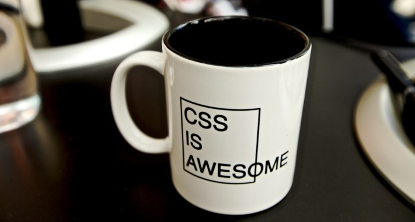
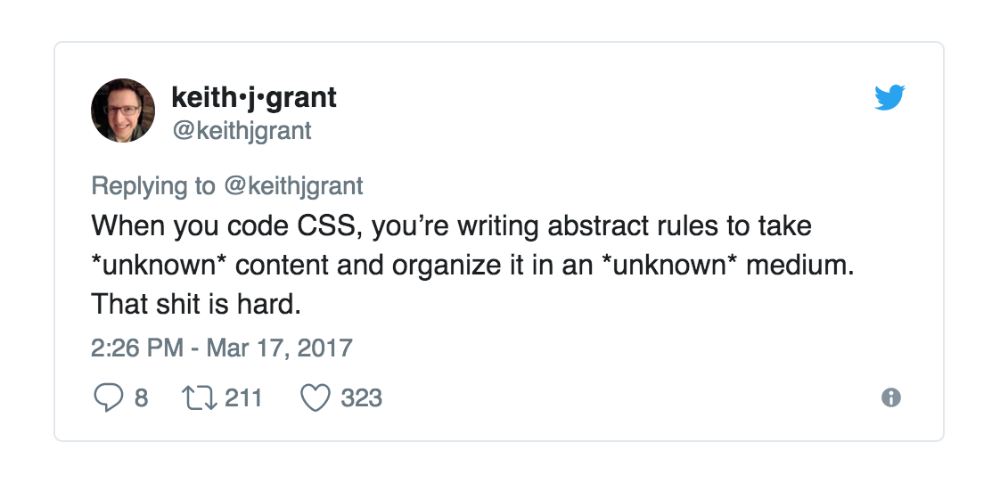

Introduction au CSS.
-------

Le CSS est un langage permettant de définir des styles visuels pour des documents structurés.

Son fonctionnement est simple, mais sa mise en œuvre est complexe. En effet, on travaille avec de nombreuses inconnues: 

- Les documents pour lesquels on crée les styles sont évolutifs.
- Le support de lecture n'est pas défini, un site pouvant être visionné sur des appareils aux propriétés variables.



Historique
-------

Le langage **CSS** (*Cascading Style Sheets*) est apparu en 1996, afin de proposer une meilleure manière de créer des sites internet, en séparant le contenu (HTML) de la présentation. CSS1 se définit comme un « mécanisme de feuille de style simple, permettant aux auteurs et aux lecteurs d'attacher des styles (…) au document HTML ». Cette simplicité se traduit par le choix d'un langage qui peut être aisément lu et écrit directement par ses utilisateurs humains, et d'une terminologie conforme aux usages courants dans la publication informatique.

Le standard CSS s'enrichit progressivement de nouvelles capacités, afin de répondre aux besoins des créateurs et utilisateurs du web. Alors que CSS1 définit essentiellement les propriétés de rendu typographique du texte, la spécification **CSS 2**, publiée en 1998, étend considérablement les possibilités théoriques des CSS, avec environ 70 propriétés supplémentaires. suivie par une version révisée, **CSS 2.1**, qui est restée en chantier pendant des années, avant d'atteindre le statut de [Recommandation W3C](https://www.w3.org/TR/CSS2/) en 2011. 

La spécification **CSS 3**, qui l'a suivie, a été développée sous la forme de modules indépendants, dans le but que des modules "prêts" puissent être implémentés rapidement par les navigateurs. Cet objectif a été atteint, et de nombreux modules sont actuellement bien supportés par les navigateurs et utilisés au quotidien (p.ex. *WebFonts*, *Media Queries*, *Flexbox*, *Backgrounds & Borders*), alors que d'autres sont encore en développement.

L'année 2010, qui marque une large adoption du standard HTML5, représente une avancée importante pour le CSS 3. C'est en 2010 que sort le livre "[CSS3 for Web Designers](https://abookapart.com/products/css3-for-web-designers)", par Dan Cederholm, et que le terme "Responsive Web Design" fait son apparition, sous la plume d'Ethan Marcotte.

    
*Le CSS Working Group du W3C, lors d'une réunion en 2010*

Principes de base
----------

> "Fundamental concepts of CSS like cascading, specificity rules, selectors, inheritance, box model and stacking context must be well understood." - [Thanh Tran](https://web.archive.org/web/20161116165031/https://blog.int3ractive.com/2015/06/baseline-for-modern-front-end-developers.html)

La langage CSS permet de définir des règles, qui sont exprimées sous forme de couples `propriété: valeur`.

Les **propriétés** sont libellées à l'aide de mots-outils anglais tels que `width` (largeur), `font-size` (taille de la police de caractères) ou `background-color` (couleur de fond). Ces propriétés sont spécifiées dans le standard CSS.

Les **valeurs** sont exprimées à l'aide d'unités (pixels, pourcents...), ou de mots-clés propres au CSS. Par exemple, une couleur peut être exprimée à l'aide des mots clés ("black", "blue", etc), de valeurs hexadécimales (p.ex. #FF0000) ou du modèle RGB.

Les couples propriété-valeur constituent le "bloc de déclaration" d'une règle CSS. S'il y en a plusieurs, on les sépare avec des points-virgule. Ces déclarations seront appliquées à des parties du document identifiées par un **sélecteur**.

Chaque règle CSS comporte un **sélecteur**, et un **bloc de déclaration**.

Exemple de règle CSS:

```css
h1 {
    color: red;
    text-transform: uppercase;
}
```

Dans cet exemple, nous avons: 

* le **sélecteur**: `h1`
* le **bloc de déclaration**, qui contient deux déclarations: `color: red;` et `text-transform: uppercase;`
* la première déclaration définit une **propriété**: `color`
* avec la **valeur**: `red`
* la seconde déclaration définit la **propriété** `text-transform;`
* avec la **valeur**: `uppercase`

Résultat: dans cette régle, on applique un style à tous les éléments `h1` du document: la couleur du texte sera rouge (`red`), et tous les caractères seront affichés en majuscules (`uppercase`).

