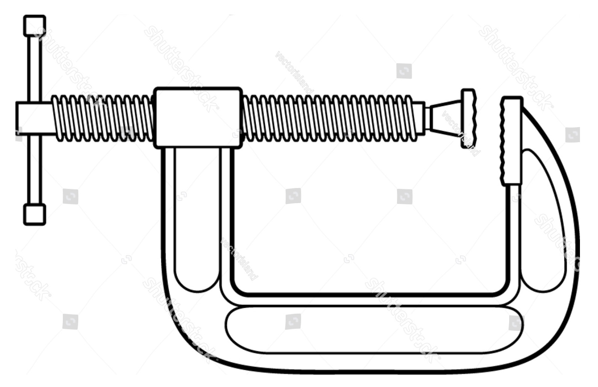

Les **fonctions CSS** `min()`, `max()` et `clamp()` sont des fonctions permettant de remplacer une unité fixe - comme par exemple `320px` - par une formule plus flexible.

### La fonction min()

La fonction CSS `min()` permet de spécifier plusieurs valeurs, et *la plus petite* sera retenue. Cela permet donc de définir un seuil maximal. Exemple, pour limiter la largeur d'un élément à un maximum de 400 pixels:

```css
width: min(50%, 400px);
```

À l'inverse, la fonction `max()` retiendra la plus grande des unités. Elle permet donc de définir un seuil minimal. Exemple:

```css
width: max(50%, 400px);
```

### La fonction clamp()

Ces fonctions sont utiles, mais on voudra souvent limiter la taille minimale *et* maximale *en même temps*. Par exemple pour la taille d'une fonte, il faut définir un minimum et un maximum, pour garantir la lisibilité sur tous les écrans.

La solution est `clamp()` : cette fonction CSS combine les propriétés de `min()` ou `max()`. Dans la spécification du W3C, il est indiqué que:

* Clamp accepte trois valeurs: valeur minimum, valeur centrale, valeur maximum.
* En cas de conflit, c'est la valeur minimum qui sera appliquée.

`clamp()` permet donc de définir à la fois:

1. une taille minimum. 
2. une valeur centrale idéale.
3. une taille maximum. 

Le mot *clamp*, en anglais, désigne cet outil:



Un exemple de taille de fonte "responsive", définie avec clamp:

```css
h1 {
  font-size: clamp(5px, 5vmax, 80px);
}
h2 {
  font-size: clamp(5px, 3vmax, 60px);
}
```

Le résultat de ce code: [https://competent-galileo-9d6914.netlify.app/](https://competent-galileo-9d6914.netlify.app/)

Un exemple pour définir la largeur d'un élément, avec 350px comme minimum et 500px comme maximum:

```css
width: clamp(350px, 50%, 500px);
```

<p class="codepen" data-height="300" data-default-tab="css,result" data-slug-hash="bGpoGdJ" data-editable="true" data-user="una" style="height: 300px; box-sizing: border-box; display: flex; align-items: center; justify-content: center; border: 2px solid; margin: 1em 0; padding: 1em;"></p>

---

Une démonstration en vidéo:

<video width="604" height="265" controls>
  <source src="img/clamp/clamp-demo.mp4" type="video/mp4">
</video>


### Ressources

- Support de cours, [Unités CSS](https://cours-web.ch/css/units.html)
- La spécification du W3C: [Comparison Functions: min(), max(), and clamp()](https://www.w3.org/TR/css-values-4/#comp-func), dans *CSS Values and Units Module Level 4*
- [Explication en vidéo](https://web.dev/min-max-clamp/), sur Web.Dev
- [Explication en vidéo](https://css-tricks.com/min-max-and-clamp-are-css-magic/), sur CSS Tricks.
- La fonction min() [dans MDN](https://developer.mozilla.org/fr/docs/Web/CSS/min()).
- La fonction max() [dans MDN](https://developer.mozilla.org/fr/docs/Web/CSS/max()).


### Erreurs possibles

Si ça ne fonctionne pas:

Attention : si vous mettez un espace entre clamp et la parenthèse ça ne marche pas:

Ecrire `clamp(20px, 10vw, 80px)` au lieu de `clamp (20px, 10vw, 80px)`.


### Différences avec vmin, vmax

Les fonctions `min()` et `max()` ne doivent pas être confondues avec les **unités** `vmin` et `vmax`. Ces dernières sont des unités relatives au *viewport*. Rappel des quatre unités *viewport*:

- `vw` :	1% de la **largeur** du *viewport*
- `vh` :	1% de la **hauteur** du *viewport*
- `vmin` :	1% de la plus petite dimension (la plus petite valeur de vh ou vw)
- `vmax` :	1% de la plus grande dimension (la plus grande valeur de vh ou vw)

Exemple utilisant vmin pour dessiner un cube, qui mesure 50% de la plus petite dimension:

<p class="codepen" data-height="300" data-default-tab="css,result" data-slug-hash="LYjWLyo" data-editable="true" data-user="eracom" style="height: 300px; box-sizing: border-box; display: flex; align-items: center; justify-content: center; border: 2px solid; margin: 1em 0; padding: 1em;"></p>
