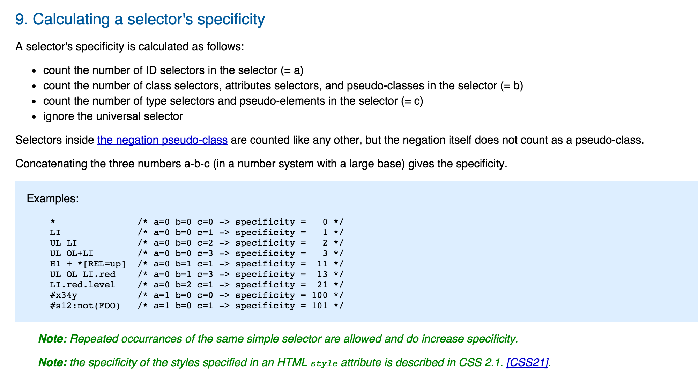
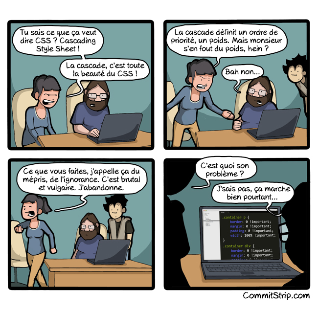

# Cascade CSS et spécificité

Tous les sélecteurs CSS ne sont pas égaux. Certains sélecteurs sont plus "puissants" que d'autres, et parviennent à surcharger des règles CSS plus faibles. Un sélecteur par identifiant – `#titre` – est plus "spécifique", donc plus puissant, qu'un sélecteur par classe – `.titre` – qui est plus puissant qu'un sélecteur par élément – `h1`.

Voici comment [la documentation du W3C](https://www.w3.org/TR/selectors-3/#specificity) explique le principe:



Quelques exemples:

```css
* {
    color: red;
}
```

Une règle utilisant comme sélecteur l'astérisque s'appliquera à tous les éléments d'une page, et aura la spécificité la plus basse, càd de zéro.

```css
li {
    color: red;
}
```

La même règle utilisant un sélecteur par élément. On aura une spécificité de (a=0 b=0 c=1), donc de 1.

```css
ul li {
    color: red;
}
```

Si on utilise deux sélecteurs de même type, leur puissance s'additionne. Avec le code qui précède, on aura une valeur de (a=0 b=0 c=2), donc 0-0-2.

```css
.red {
    color: red;
}
```

On utilise maintenant sélecteur de type "classe". Un monte d'un niveau de puissance (a=0 b=1 c=0), ce qui se traduit par une spécificité de 0-1-0.

```css
header .red {
    color: red;
}
```

Ici le résultat sera (a=0 b=1 c=1), autrement dit: 0-1-1.

```css
#sidebar {
    color: red;
}
```

Avec l'utilisation d'un sélecteur ID (#), on monte au troisième niveau de puissance. La valeur de ce sélecteur sera (a=1 b=0 c=0), autrement dit: 1-0-0.

Les différences de puissance entre les sélecteurs font que l'ordre de la "cascade CSS" ne s'applique pas forcéement.

Par exemple dans ce code:

```css
#header a { color: blue; }     /* a=1 b=0 c=1 -> specificity = 1-0-1 */
.header nav > a { color: red } /* a=0 b=1 c=2 -> specificity = 0-1-2 */
```

De manière non intuitive, c'est la ligne du haut (couleur bleue) qui "gagne", car sa spécificité est plus puissante que celle du bas (1-0-1 vs. 0-1-2).

Un codepen de démonstration:

<p class="codepen" data-height="300" data-default-tab="html,result" data-slug-hash="oNEXLLY" data-user="eracom" style="height: 300px; box-sizing: border-box; display: flex; align-items: center; justify-content: center; border: 2px solid; margin: 1em 0; padding: 1em;"></p>

## Explications visuelles

Pour mieux comprendre ce principe, des designers ont créés des explicatifs visuels:

Visualisation basée sur The Shining: http://cdn.w3cplus.com/sites/default/files/blogs/2013/1312/CSS_Specificity.jpg

Visualisation basée sur Star Wars, [Specificity Wars](https://stuffandnonsense.co.uk/archives/css_specificity_wars.html), par Andy Clarke (créé en 2005, mis à jour en 2018).


Visualisation aquatique, [CSS SpeciFISHity](http://www.standardista.com/css3/css-specificity/), par Estelle Weyl.

## Bonnes pratiques

Selon l'experte en performance du code CSS [Nicole Sullivan](http://www.stubbornella.org/content/2011/04/28/our-best-practices-are-killing-us/), il faut privilégier les classes et éviter les sélecteurs ID. Voici un exemple de code à éviter:

```css
#sidebar #accounts #accountDetails h3{}
```

> Classes are our friends. Seeing a lot of IDs is actually very bad. Run from this kind of code!

## Ressources

### Calculateurs de spécificité: 

- [http://specificity.keegan.st/](http://specificity.keegan.st/)
- Calculateur sous forme de graphique: [https://jonassebastianohlsson.com/specificity-graph/](https://jonassebastianohlsson.com/specificity-graph/)

### Explication en vidéo

<iframe width="100%" style="aspect-ratio: 16/9;" src="https://www.youtube-nocookie.com/embed/ygmYgNzlQ1E?si=pkTsH7zE7f21rteh" title="YouTube video player" frameborder="0" allow="accelerometer; autoplay; clipboard-write; encrypted-media; gyroscope; picture-in-picture; web-share" allowfullscreen></iframe>

### Articles et tutoriels

*[Cascade CSS et priorité des sélecteurs](http://openweb.eu.org/articles/cascade_css)*, par Laurent Denis, 2005

*La spécificité des sélecteurs*, [Grafikart](https://grafikart.fr/tutoriels/specificite-selecteur-css-1045), 2018


