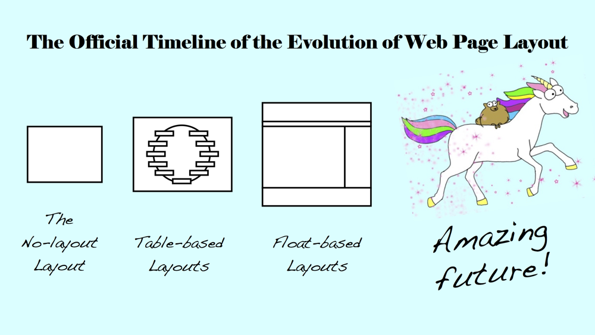
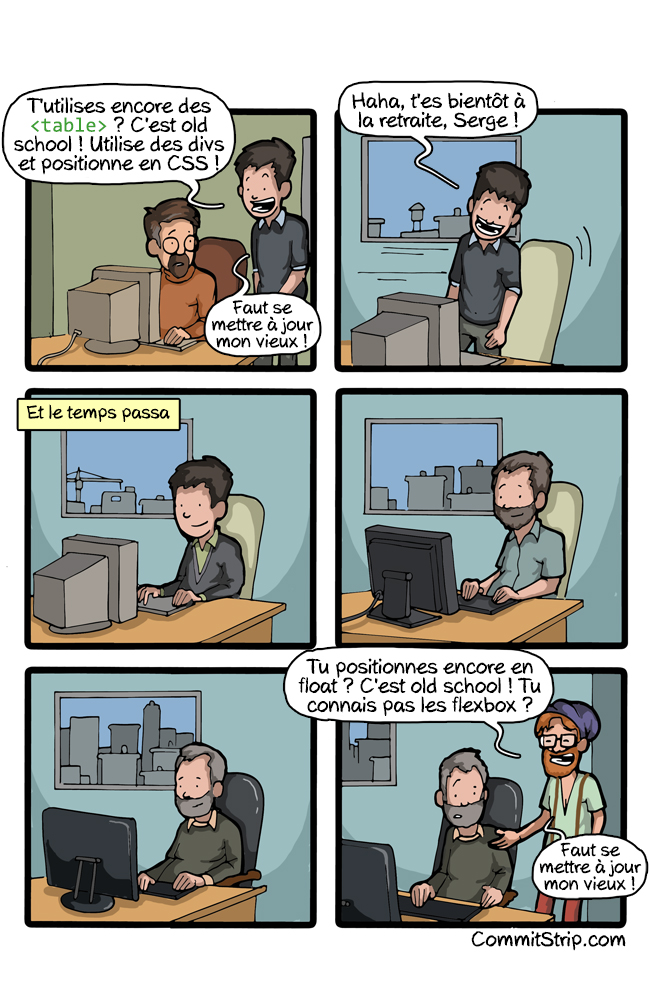
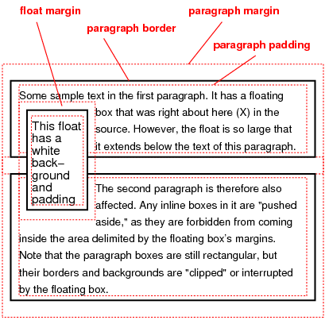
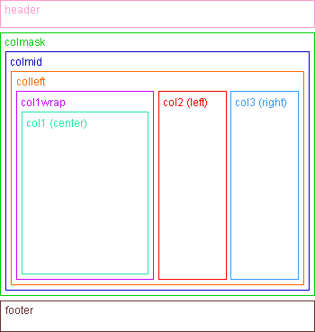
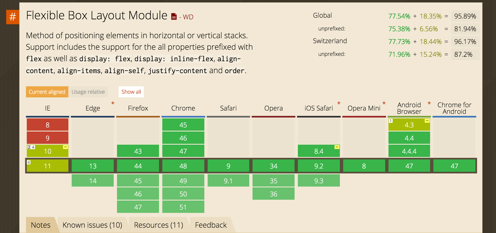
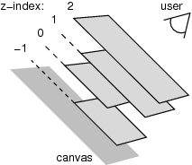

Méthodes de positionnement et mise en page
----------

> Now, finally, we have real tools for layout. CSS properties that were created to do layout. **CSS Grid**, **Flexbox**, **Alignment**, **Writing Modes**, **Multicolumn**, along with, yes, Floats, Positioning, Inline Block, Display Table — just to name a few. – [Jen Simmons](http://jensimmons.com/post/feb-28-2017/benefits-learning-how-code-layouts-css)

Deux bonnes introductions à la mise en page et au positionnement CSS:

* *[Introduction au positionnement CSS](http://www.pompage.net/traduction/introduction-au-positionnement-css){: .ref}*, par Noah Stokes, 2010 (aussi [en anglais](http://alistapart.com/article/css-positioning-101)).
* *[Apprendre les mises en page CSS](http://fr.learnlayout.com/){: .ref}*, par Greg Smith.

Mise en page CSS
----------

Depuis le lancement du CSS en 1996, diverses techniques ont été développées pour créer des mises en page avec ce langage.



Pendant longtemps, des mises en page ont été créées avec le positionnement **"Float"**. Depuis l'introduction du CSS3, on peut utiliser le module **CSS Flexbox**. Pour l'avenir, le module **CSS Grid Layout** propose des solutions intéressantes.



Positionnement avec Float
===

"En octobre 2002, le site du magazine wired.com a bénéficié d'une refonte qui n'utilisait aucune table", déclare Eric Meyer (alors employé de Netscape) dans un discours[^1] à la conférence TODCON (*The Other Dreamweaver Conference*) en 2003. Meyer démontre que l'utilisation du CSS pour la mise en page (au lieu des tableaux) permet de gagner du temps de développement, et de réduire le temps de chargement d'un site.

[^1]: "In October 2002, wired.com redesigned using no tables at all. (...) Basically [Eric Meyer] presented proof of how much bandwidth and time CSS layouts can save you" - http://meyerweb.com/eric/talks/2003/todcon/payoff/keynote.html

En 2004, des designers web font une véritable campagne pour pousser leur profession à abandonner les mises en page construites avec des tableaux HTML. 

- Dans son livre *More Eric Meyer on CSS* (2004), Eric Meyer décrit comment convertir des tableaux en mises en page CSS.
- Douglas Bowman donne la présentation *No More Tables, CSS Layout Techniques*[^2] à la conférence Digital Design World à Seattle, durant laquelle il "reconstruit" le site actuel de Microsoft.

[^2]: http://stopdesign.com/archive/2004/07/27/throwing-tables.html

Pour maîtriser la méthode de mise en page CSS préconisée, il est essentiel de comprendre les propriétés CSS suivantes:

- **float** (valeurs possibles: left, right)
- **clear** (valeurs possibles: left, right, both)



Cette méthode présente toutefois des difficultés, quand il s'agit de créer une mise en page flexible (avec des largeurs de colonnes exprimées en pourcentage). Dans le jargon, on parle du "Holy Grail Layout" (le *Saint Graal* de la mise en page), qui comprend deux colonnes à largeur fixe (les barres latérales), et un contenu central à largeur flexible (qui augmentera avec la taille de l'écran).

    
*Une structure HTML complexe pour obtenir le Holy Grail Layout*

> Cela fait des années que l’on torture la propriété float pour gérer la mise en page. On fait avec, mais un véritable moteur de mise en page est une nécessité absolue. - *Dan Cederholm, 2010*

Une nouvelle approche: Flexbox
===

Flexbox est un module CSS récent, qui propose une manière novatrice de définir des mises en page extrêmement "flexibles". Ce module est récemment passé du statut de "Working Draft" (depuis 2009) à "Candidate Recommendation". 

Dans la pratique, le module Flexbox est déjà [bien supporté](http://caniuse.com/#search=flexbox) par les navigateurs. On peut donc recommander son utilisation pour des projets réels. Le framework *Bootstrap* a récemment modifié son [système de grille](http://getbootstrap.com/css/#grid), qui était basé sur les *floats*, pour utiliser Flexbox (en option depuis 2015 [dans Boostrap 4 alpha](http://blog.getbootstrap.com/2015/08/19/bootstrap-4-alpha/), par défaut [depuis 2017](http://blog.getbootstrap.com/2017/01/06/bootstrap-4-alpha-6/)).


*Support des navigateurs pour Flexbox (source: [Can I Use](http://caniuse.com/#feat=flexbox), mars 2016)*

#### Ressources Flexbox

Quelques bonnes ressources pour maîtriser ce module CSS:

- Une démonstration: [https://demos.scotch.io/visual-guide-to-css3-flexbox-flexbox-playground/demos/](https://demos.scotch.io/visual-guide-to-css3-flexbox-flexbox-playground/demos/)
- Un article: [http://fr.learnlayout.com/flexbox.html](http://fr.learnlayout.com/flexbox.html)
- Un autre article sur Alsa Créations:
[http://www.alsacreations.com/tuto/lire/1493-css3-flexbox-layout-module.html](http://www.alsacreations.com/tuto/lire/1493-css3-flexbox-layout-module.html)
- Un article (en anglais): 
[https://css-tricks.com/snippets/css/a-guide-to-flexbox/](https://css-tricks.com/snippets/css/a-guide-to-flexbox/)
- Des exemples d'usages typiques:
[http://philipwalton.github.io/solved-by-flexbox/](http://philipwalton.github.io/solved-by-flexbox/)
- [Un exemple de Holy Grail layout](https://jsfiddle.net/n7nk0hac/79/), par Belén Albeza

CSS Grid Layout
===

Le *CSS Grid Layout* est une nouvelle spécification CSS, en cours d'implémentation, qui a le potentiel de révolutionner la mise en page CSS. Comme son nom l'indique, il s'agit d'un modèle de mise en page basé sur une *grille* à deux dimensions, sur laquelle viennent se placer des blocs de contenu.

Cette fonctionalité CSS a été proposée en 2011 par Microsoft, et implémentée à fins de test dans Internet Explorer 10 et 11. Le projet a été repris par le W3C, où son développement se poursuit.

> En début 2017, le module CSS Grid Layout fait son entrée dans les navigateurs. Il est actif dans Firefox 52 (sorti le 7 mars 2017) et Chrome 57 (sorti le 9 mars 2017).

Il est donc désormais possible de l'utiliser, avec la méthode de chargement CSS optionnel @feature:

```css
@supports ( display: flex ) {
  .foo { display: flex; }
}
```

#### Ressources CSS Grid Module

* Support actuel des navigateurs: [http://caniuse.com/#feat=css-grid](http://caniuse.com/#feat=css-grid)
* Un tutoriel (le site de référence de Rachel Andrew): [http://gridbyexample.com/what/](http://gridbyexample.com/what/)
* Un autre tutoriel (par Alsa Créations):
[http://www.alsacreations.com/article/lire/1388-css3-grid-layout.html](http://www.alsacreations.com/article/lire/1388-css3-grid-layout.html)
* Un livre publié en début 2016 par Rachel Andrew: *Get Ready For CSS Grid Layout*, A Book Apart, 2016

### Z-index

Disposition verticale des éléments d'une page web. On contrôle l'ordre vertical des éléments avec la propriété z-index. Plus cette valeur est grande, plus un élément se trouve propulsé vers le "devant" de la scène.



Habituellement, les pages HTML sont dites «en 2D» car les éléments (texte, images etc.) s’arrangent sur la page pour ne pas se chevaucher. Par contre, en CSS 2.1, chaque élément est en 3D. En effet, en plus de leur axe vertical (axe Y) et horizontal (axe X), s’ajoute un axe de profondeur perpendiculaire aux autres, l’axe-Z. Cet axe se contrôle avec la propriété CSS Z-index.


Le Z-index contrôle l’axe Z et donc l’ordre d’empilement des éléments qui se chevauchent sur une page. Elle permet de décider quel élément va au-dessus ou au-dessous des autres, selon la valeur Z-index attribuée à l’élément. 

#### Les 4 règles du Z-index

**Régle 1:** Les valeurs Z-index les plus élevées sont au premier plan, et les valeurs Z-index plus faibles sont en arrière-plan. 

Exemple: Un z-index de 2 sera placé au dessus d’un z-index de 1, et un z-index de -1 sera placé au dessus d’un z-index de -2.

**Régle 2:** Le Z-index ne concerne que les éléments dont la position n’est pas `static` (= valeur de position par défaut). Il marche donc pour les éléments dont la position est soit `relative`, `absolute` ou `fixed`. 

Exemple:

```css
div#test1 {z-index: 10;} 
div#test2 {position: absolute; z-index: 2;}
```
- L’élément qui sera au dessus sera div#test2, car il est positionné.
- L’élément qui sera au dessous sera div#test1 (qui ne se place pas au-dessus malgré un Z-index de 10, car il n’est pas positionné).

**Régle 3:** En l’absence de valeur Z-index, les éléments s’arrangent selon l’ordre d’apparition dans le code HTML (l’élément apparaissant en dernier apparaît au-dessus des autres).


#### Ordre naturel de chevauchement

Sur une page HTML, l’ordre naturel (*sans z-index*) des éléments sur l’axe Z s’organise comme ceci (de l’élément le plus derrière à l'élément le plus devant):

* Couche 1)	Background + borders d’un élément source
* Couche 2)	Eléments blocs (sans position, ni float), par ordre d’apparition dans le code HTML
* Couche 3)	Eléments positionnés, par ordre d’apparition dans le code HTML
	
**Notes:**

* Si plusieurs éléments de même nature (ex: 2 div) se situent sur la même couche, l’ordre d’apparition dans le code HTML fait foi.
* Un élément non-positionné se situera toujours sous un élément positionné, même s’il apparaît plus tard dans l’ordre HTML.
* Si un élément B est au-dessus d’un élément A, un enfant de l’élément A ne pourra jamais être au-dessus de l’élément B (peut importe la hauteur de son z-index).

#### Les 7 niveaux de chevauchement

Sur une page HTML, l’ordre naturel (avec z-index) des éléments sur l’axe Z s’organise comme ceci (de l’élément le plus derrière à l'élément le plus devant):

* Couche 1) Background + borders d’un élément source
* Couche 2) Z-Index négatifs 
* Couche 3) Eléments blocs (sans position, ni float)
* Couche 4) Eléments floats (sans position)
* Couche 5) Eléments «inline» (sans position)
* Couche 6) Z-index: 0 + éléments positionnés
* Couche 7) Z-index positifs + éléments positionnés
	
#### Comment ajouter un Z-index?

Initialement, le Z-index par défaut est à valeur «auto».
Si on veut un ordre spécifique, il faut positionner l’élément et y appliquer la propriété Z-index. 

Voici les valeurs qu’on peut lui appliquer:

**1) La valeur auto (valeur de base)**

Aucun changement d’ordre n’est appliqué, l’ordre initial HTML prime.

```css 
z-index: auto;
```

**2) Une valeur "chiffre"**

Positive ou négative, cette valeur indique la position de l’élément sur l’axe Z.

```css
z-index: 0;
z-index: 3;
z-index: 289;
z-index: -1; /* valeur négative */
```

**3) Les valeurs globales**

```css
z-index: inherit; /*hérite sa propriété de l’élément parent */
z-index: initial; /*ramène à la valeur par défaut */
z-index: unset; /*ramène à la valeur par défaut */
```

#### Bien utiliser le Z-index

Certaines personnes adorent utiliser des valeurs Z-index ridiculement hautes pour être certain que l’élément apparaîtra bien en premier. Mais la meilleure manière de faire est d’incrémenter la valeur de 100 en 100. 

Exemple: 

```
1) z-index: 0, 
2) z-index: 100
2 bis) z-index: 110
3) z-index: 200
```
Avec cette technique, on possède un espace libre au cas où on aurait besoin d’intercaler un élément entre 2 couches (2 bis). Ce champ d’action aurait été restreint si on avait mis les valeurs 1,2 et 3.

#### Navigateurs

Le Z-index est supporté par tous les navigateurs. Cependant, seuls les navigateurs les plus à jour supportent une valeur Z-index négative.

* Site utile: [http://www.cssmojo.com/](http://www.cssmojo.com/extras/everything_you_always_wanted_to_know_about_z-index_but_were_afraid_to_ask/)

Lire: *[How z-index Works](https://bitsofco.de/how-z-index-works/)*, par Ire Aderinokun.

### L'effet Masonry

Masonry est un utilitaire Javascript pour produire des mises en page imbriquées (métaphore de la maçonnerie), qui ne sont pas réalisables en pur CSS.

Il existe différentes librairies JavaScript produisant cet effet:

**Masonry**  
Poids: 25 kb  
[L'original](https://masonry.desandro.com/), créé par David DeSandro [en 2008](https://metafizzy.co/blog/beginning/). La v2 est sortie en 2011, la v3 (sans jQuery) en 2013.

**Salvattore**  
Poids: 8kb  
"A jQuery Masonry alternative with CSS-driven configuration."  
[https://github.com/rnmp/salvattore](https://github.com/rnmp/salvattore)  
N'est plus maintenu depuis 2018.

**Macy.js**  
Poids:  10kb  
"A lightweight, dependency-free masonry layout library."  
[http://macyjs.com/](http://macyjs.com/)

### Masonry sans JavaScript

Il est possible d'obtenir ce type d'effet en utilisant uniqument du CSS (avec Flexbox ou les colonnes CSS) ... mais il y a une limitiation: vous aurez des colonnes verticales. Les éléments ne seront pas dans un ordre de lecture horizontal.

**Driveway**  
Poids: 4kb (3161 bytes)  
"pure CSS masonry layout aid"  
Code: [https://github.com/jh3y/driveway](https://github.com/jh3y/driveway)  
Demo: [http://jh3y.github.io/driveway](http://jh3y.github.io/driveway)

Divers tutoriaux:

* *[HOW TO: Pure CSS masonry layouts](https://medium.com/@_jh3y/how-to-pure-css-masonry-layouts-a8ede07ba31a#.dc110izd7)*, par Jhey Tompkins, 2016.
* *[Masonry style layout with CSS Grid](https://medium.com/@andybarefoot/a-masonry-style-layout-using-css-grid-8c663d355ebb)*, par Andy Barefoot, 2017.
* [Easy Masonry Layout With Flexbox](http://thenewcode.com/844/Easy-Masonry-Layout-With-Flexbox), par Dudley Storey, 2014.
* https://codepen.io/dudleystorey/pen/eAqzk - Simple Masonry Layout With Flexbox, A PEN BY Dudley Storey
* http://w3bits.com/css-masonry/
* https://codepen.io/AdamBlum/pen/fwrnE
* https://jsfiddle.net/gabrieleromanato/tQANc/

Références - mise en page CSS:
===

**En français:**

- *[Le tournant des CSS vers le Layout](http://www.paris-web.fr/2012/conferences/le-tournant-des-css-vers-le-layout.php)* - conférence de Daniel Glazman, à Paris Web 2012. Présente diverses nouveautés: CSS Variables, CSS Flexbox, CSS Regions, CSS Exclusions and Shapes, CSS Grids, Blending & Compositing, Web Fonts, CSS Filter Effects.
- *[Learn CSS Layout](http://fr.learnlayout.com/)* - un tutoriel très complet pour apprendre la mise en page CSS. Ecrit par Greg Smith, traduction par Joël Matelli.

**En anglais:**

- *[An Introduction to CSS Grid Layout](http://www.paris-web.fr/2015/conferences/an-introduction-to-css-grid-layout.php)* - conférence de Rachel Andrew, à Paris Web 2015, Présente le module CSS Grid Layout.
- *[The Magic of CSS](http://adamschwartz.co/magic-of-css/)*, par Adam Schwartz, un tutoriel en six chapitres. Introduction basique, il n'aborde pas Flexbox ou Grid Layout.
- *[Learn HTML & CSS](http://www.frontendhandbook.com/learning/html-css.html)*, liste de références et tutoriels sur le développement frontend.

